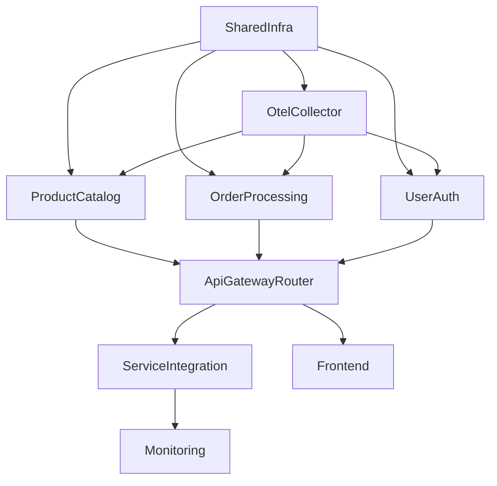

# ShopSmart CDK Multi-Stack Implementation

This directory contains the AWS CDK (TypeScript) implementation of the ShopSmart application infrastructure using a **multi-stack architecture**. Each microservice is deployed in its own stack, enabling independent deployments and better team autonomy.

## Architecture Overview

ShopSmart consists of multiple microservices deployed across **9 separate CDK stacks**:

### 🏗️ **Stack Architecture**
```
├── ShopSmart-SharedInfra-v2          # VPC, Subnets, Networking
├── ShopSmart-OtelCollector-v2        # OpenTelemetry Collector
├── ShopSmart-ProductCatalog-v2       # EC2, RDS, ElastiCache, ALB
├── ShopSmart-OrderProcessing-v2      # ECS Fargate, MongoDB
├── ShopSmart-UserAuth-v2             # Lambda, API Gateway, DynamoDB
├── ShopSmart-ApiGatewayRouter-v2     # Unified API Gateway for all services
├── ShopSmart-ServiceIntegration-v2   # EventBridge, SNS, Cross-service communication
├── ShopSmart-Frontend-v2             # CloudFront, S3, Static Website
└── ShopSmart-Monitoring-v2           # CloudWatch Dashboards, Alarms
```

### 🎯 **Microservices**
1. **Product Catalog Service**: EC2-based service with RDS PostgreSQL and ElastiCache Redis
2. **Order Processing Service**: ECS Fargate-based service with MongoDB
3. **User Authentication Service**: Serverless service with Lambda, API Gateway, and DynamoDB
4. **API Gateway Router**: Unified HTTP API routing layer for all backend services
5. **Frontend**: CloudFront distribution serving static website from S3

## Multi-Stack Benefits

✅ **Independent Deployments**: Teams can deploy their services separately  
✅ **Reduced Blast Radius**: Issues isolated to individual services  
✅ **Better Resource Management**: Each stack stays under CloudFormation limits  
✅ **Team Autonomy**: Different teams can own different stacks  
✅ **Selective Rollbacks**: Roll back only the affected service  
✅ **Environment-specific Deployments**: Deploy different services to different environments  

## Deliberate Flaws Implemented

This CDK implementation maintains intentional inefficiencies for demonstration and optimization exercises:

### Resource Utilization Issues
- **EC2 Instance Overprovisioning**: m5.xlarge instances with only 20% CPU utilization
- **RDS Performance Constraints**: gp2 storage, undersized instance hitting IOPS limits
- **Cache Inefficiency**: Oversized ElastiCache Redis nodes
- **ECS Task Overprovisioning**: Tasks with excessive CPU/memory allocation
- **Lambda and DynamoDB Issues**: Overprovisioned Lambda memory, low DynamoDB capacity

## Repository Structure

```
shopsmart/
├── deployment/
│   ├── cdk/                           # CDK infrastructure code
│   │   ├── bin/                       # CDK app entry points
│   │   ├── lib/                       # CDK stack definitions
│   │   │   ├── stacks/               # Stack implementations
│   │   │   └── constructs/           # Reusable constructs
│   │   ├── docker/                   # Docker images for services
│   │   └── lambda/                   # Lambda function code
│   └── scripts/                       # Deployment and utility scripts
├── src/
│   ├── frontend/                      # Frontend application (HTML/JS)
│   ├── services/                      # Backend microservices
│   │   ├── product-catalog/          # Product Catalog API (Python/Flask)
│   │   ├── order-processing/         # Order Processing API (Python/FastAPI)
│   │   └── user-auth/                # User Auth API (Python/FastAPI)
│   └── database/                      # Database schemas and seed scripts
├── scripts/                           # Utility scripts
│   └── simulate-failures.sh          # Failure simulation tool
├── .env.example                       # Example environment configuration
├── .env.dynatrace                     # Dynatrace configuration (create from example)
└── README.md
```

## Prerequisites

1. **Install AWS CDK:**
   ```bash
   npm install -g aws-cdk
   ```

2. **Install dependencies:**
   ```bash
   cd deployment/cdk
   npm install
   ```

3. **Bootstrap CDK (first time only):**
   ```bash
   cd deployment/cdk
   cdk bootstrap
   ```

4. **Configure AWS credentials:**
   ```bash
   aws configure
   ```

## Dynatrace Configuration (Optional)

ShopSmart includes OpenTelemetry instrumentation that can send traces to Dynatrace.

1. **Create `.env.dynatrace` file:**
   ```bash
   cp .env.example .env.dynatrace
   ```

2. **Update with your Dynatrace credentials:**
   ```bash
   # Production Environment
   DYNATRACE_PROD_ENDPOINT=https://your-env.live.dynatrace.com
   DYNATRACE_PROD_API_TOKEN=dt0c01.YOUR_API_TOKEN_HERE
   DYNATRACE_PROD_ENV_ID=your-env-id
   
   # AWS Configuration
   CDK_DEFAULT_REGION=us-west-2
   CDK_DEFAULT_ACCOUNT=your-account-id
   ```

3. **Deploy with Dynatrace enabled:**
   The deployment scripts will automatically detect `.env.dynatrace` and configure OpenTelemetry to send traces to your Dynatrace environment.

## Deployment Options

### 🚀 **Option 1: Deploy Entire ShopSmart Application (Recommended)**
```bash
./deployment/scripts/deploy-shopsmart.sh
```

### 🔧 **Option 2: Manual Deployment**

**Deploy all stacks:**
```bash
cd deployment/cdk
npm run build
cdk deploy --all
```

**Deploy stacks individually:**
```bash
cd deployment/cdk

# 1. Deploy shared infrastructure first
cdk deploy ShopSmart-SharedInfra-v2

# 2. Deploy OpenTelemetry collector
cdk deploy ShopSmart-OtelCollector-v2

# 3. Deploy microservices (can be done in parallel)
cdk deploy ShopSmart-ProductCatalog-v2
cdk deploy ShopSmart-OrderProcessing-v2
cdk deploy ShopSmart-UserAuth-v2

# 4. Deploy API Gateway Router
cdk deploy ShopSmart-ApiGatewayRouter-v2

# 5. Deploy service integration
cdk deploy ShopSmart-ServiceIntegration-v2

# 6. Deploy frontend
cdk deploy ShopSmart-Frontend-v2

# 7. Deploy monitoring
cdk deploy ShopSmart-Monitoring-v2
```

**Deploy specific stack:**
```bash
cd deployment/cdk
cdk deploy ShopSmart-ProductCatalog-v2
```

## Validation

After deployment, validate the system:

```bash
./deployment/scripts/validate-system.sh
```

This script tests:
- CloudFormation stack health
- Product Catalog API endpoints
- User Authentication service
- Order Processing service
- Frontend accessibility
- Database connectivity
- Complete user journey

## Simulating Failures

ShopSmart includes a failure simulation tool for testing observability and resilience:

```bash
./scripts/simulate-failures.sh
```

**Available scenarios:**

1. **Order Traffic Spike**
   - Generates 500-20,000 concurrent order requests
   - Causes high latency and potential dropped orders
   - Tests auto-scaling and circuit breakers
   - Useful for load testing and observability validation

2. **Break Auth Service**
   - Modifies DynamoDB table name in Lambda environment variables
   - Causes authentication failures across the application
   - Tests error handling and circuit breaker behavior
   - Demonstrates cascading failure scenarios

3. **Restore Auth Service**
   - Restores correct DynamoDB table name
   - Returns authentication service to normal operation
   - Tests recovery and circuit breaker reset

**Example usage:**
```bash
# Run traffic spike
./scripts/simulate-failures.sh
# Select option 1, confirm with 'y'

# Monitor in Dynatrace or CloudWatch to observe:
# - Increased latency
# - Error rates
# - Circuit breaker activations
# - Auto-scaling events
```

## Stack Dependencies



## Service Endpoints

After deployment, access your services:

- **Frontend**: `https://<cloudfront-domain>.cloudfront.net`
- **API Gateway**: `http://<api-gateway-alb>.us-west-2.elb.amazonaws.com`
- **Health Check**: `https://<cloudfront-domain>.cloudfront.net/health`

Get endpoints from CloudFormation outputs:
```bash
aws cloudformation describe-stacks --region us-west-2 \
  --stack-name ShopSmart-Frontend-v2 \
  --query 'Stacks[0].Outputs'
```

## Monitoring and Observability

### CloudWatch Dashboards
Each service has dedicated CloudWatch dashboards:
- Product Catalog: EC2 metrics, RDS performance, Redis cache hits
- Order Processing: ECS task metrics, MongoDB connections
- User Auth: Lambda invocations, DynamoDB throttling
- API Gateway: Request rates, latency, error rates

### OpenTelemetry Integration
- Distributed tracing across all services
- Automatic trace correlation
- Sends to Dynatrace (if configured) or CloudWatch

### Health Checks
Unified health endpoint aggregates status from all services:
```bash
curl https://<cloudfront-domain>.cloudfront.net/health
```

## Database Seeding

The Product Catalog database is automatically seeded during deployment with 50 artisan desk products. The seeding process:
- Runs as an ECS Fargate task
- Is idempotent (safe to run multiple times)
- Checks if products already exist before seeding
- Includes PostgreSQL schema migrations

To manually trigger seeding:
```bash
cd deployment/cdk
cdk deploy ShopSmart-ProductCatalog-v2
```

## Optimization Opportunities

See `OPTIMIZATION_GUIDE.md` for detailed optimization strategies:

1. **Right-sizing resources**: Downsize EC2 instances, reduce minimum ASG sizes
2. **Improving database performance**: Use io1/io2 storage, add read replicas
3. **Enhancing caching strategy**: Implement CDN, optimize Redis sizing
4. **Implementing better scaling policies**: Lower minimums, aggressive scale-down
5. **Improving monitoring**: Add detailed performance monitoring and custom metrics

**Estimated cost savings: 50-65%** of current infrastructure costs.

## Cleanup

### **Option 1: Teardown and Redeploy (Recommended)**
```bash
./deployment/scripts/teardown-and-redeploy.sh
```

### **Option 2: CDK**
```bash
cd deployment/cdk
cdk destroy --all
```

**Destroy specific stack:**
```bash
cd deployment/cdk
cdk destroy ShopSmart-ProductCatalog-v2
```

**Note**: Destroy stacks in reverse dependency order to avoid errors:
1. ShopSmart-Monitoring-v2
2. ShopSmart-Frontend-v2
3. ShopSmart-ServiceIntegration-v2
4. ShopSmart-ApiGatewayRouter-v2
5. ShopSmart-UserAuth-v2, ShopSmart-OrderProcessing-v2, ShopSmart-ProductCatalog-v2
6. ShopSmart-OtelCollector-v2
7. ShopSmart-SharedInfra-v2

## Troubleshooting

### Stack in UPDATE_ROLLBACK_COMPLETE state
```bash
cd deployment/cdk
cdk deploy ShopSmart-<StackName>-v2 --force
```

### Docker build fails on Apple Silicon
The deployment automatically builds Docker images for AMD64 architecture. If you encounter issues:
```bash
export DOCKER_DEFAULT_PLATFORM=linux/amd64
```

### Database not seeded
Check ECS task logs:
```bash
aws logs tail /aws/ecs/seed-database --region us-west-2 --follow
```

### Frontend returns 403 errors
Ensure CloudFront distribution has finished deploying (can take 10-15 minutes):
```bash
aws cloudfront get-distribution --id <distribution-id>
```
